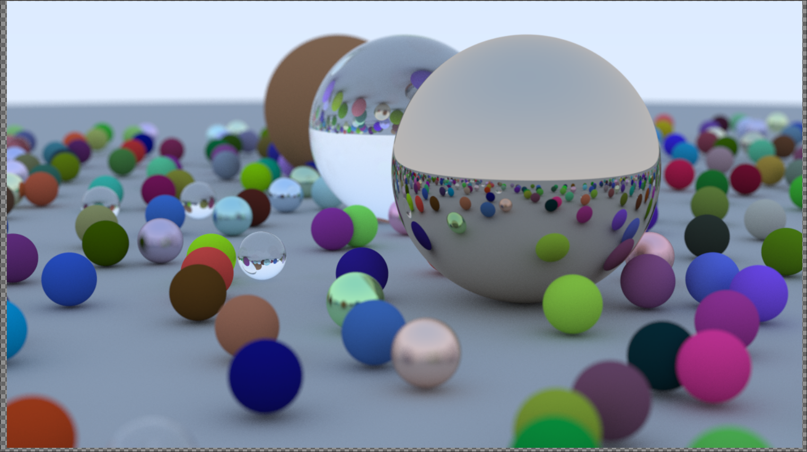

# My implementation of a Raytracer folloiwng [Raytracing In a Weekend](https://raytracing.github.io/books/RayTracingInOneWeekend.html)

> [!NOTE]
> I compile the program using the c2x standard, I believe you need your `gcc` version to be at least gcc-13.

You can see the results my simply running Make, note that this requires you to have `feh` installed on your system.

If you'd like to use a different program you can just create the .ppm file by doing `make run > {name}.ppm`

If you have any suggestions I would love to hear them! I have never really messed around with Makefiles and I suspect that it is not great in its current state but it works for my purposes so far. Also this is my first big C project, so I also suspect that I am not doing great things with headers.

# Final Render

## TODO

- Continue on with second book
- Create way for the program to handle different types of objects (More than just spheres)
- Optimize performance
